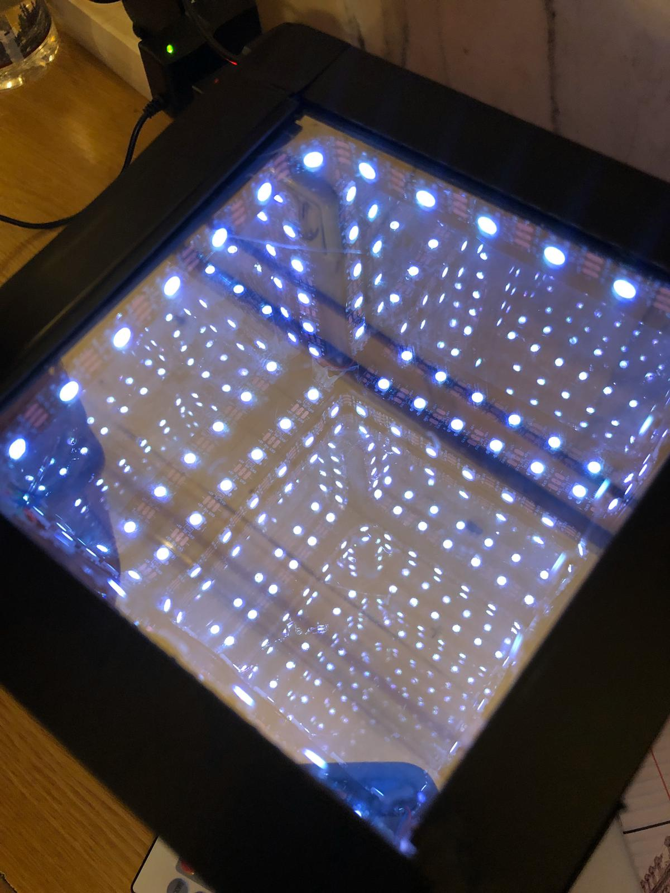

# ICOSAHEDRON BABY

### An infinity mirror inside a cube.
It is known as Hypecube, creating the effect of multidimensional object.

Inside are 6 RGB LED strips, that cand be set to multiple colors or animations, 
using an remote controler and an infrared light reciver.

