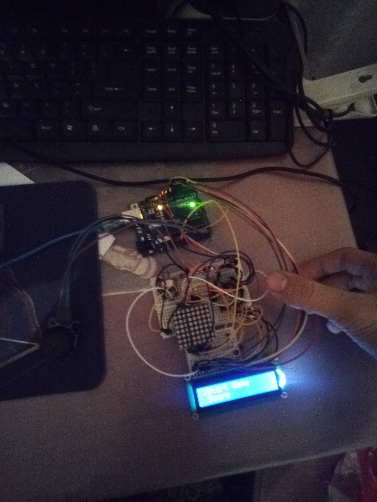

# Matrix Game

## Feed Joe

### The ideea: 

Joe is hungry:

<ul>
<li>run and catch some food for him</li>
<li>try not to run into walls!</li>
</ul>

### Gameplay: 
Joe is hungry, he want to eat something. 
Make Joe run and catch some food, but be careful, not to make him run into walls. 
Running takes energy, so Joe need to eat more to keep running.
The more food you eat(combo like), the more energy you will gain, but this also
applies to exhaustion, more you run faster you will lose energy. 
And there is an hunger effect that give you illusions, you may see some food into walls, 
better don't try to eat these.

### How to play:
<ul>
<li> You control Joe, a little dot, using the joystick </li>
<li> Move to doge the objects that get in your way(these objects are 2 pixels wide) </li>
<li> Go for the food (the blinking dots) </li>
<li> Try to keep eating to get more energy, and run a bigger distance</li>
<li> Be carefull with what you want to eat.</li>
</ul>

### Requirements
Hardware:
<ul>
<li> 8x8 LED matrix </li>
<li> LCD </li>
<li> Joystick </li>
<li> MAX7219 Driver </li>
</ul>

### Final Product

